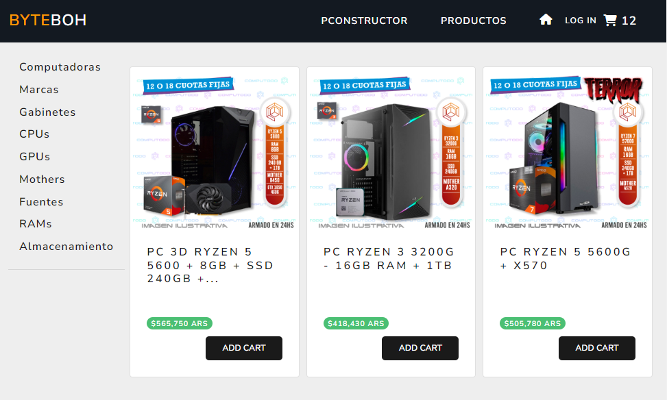

# Electronic-Components-Store

Un sitio web para la venta de productos electrónicos que ha sido desarrollado utilizando las tecnologías Node.js y Express, con MongoDB como base de datos. Este sitio web incluye una sección especializada en el armado de computadoras que ofrece validaciones de compatibilidad entre los componentes, lo que permite a los clientes elegir los productos más adecuados para satisfacer sus necesidades específicas.

 

## Uso
Esta aplicación es un e-commerce ficticio que permite a los usuarios agregar productos al carrito, crear nuevos productos, actualizar y eliminar productos existentes, así como visualizarlos. Además, cuenta con un sistema de usuarios que limita y agrega funciones en función de su rol asignado.

Para acceder a todas las funcionalidades de la página, se debe crear un usuario con el rol de "vendedor" en /users/signup. Esto permitirá al usuario crear, actualizar y borrar todos los productos disponibles.

Actualmente, los productos deben ser creados manualmente y agregados a la base de datos.

## Deploy

El proyecto se encuentra alojado en https://byteboh.onrender.com/ y cuenta con un sistema de usuarios. Si deseas agregar y/o editar productos, deberás crear un usuario con el rol de vendedor. No es necesario proporcionar datos reales, solo asegúrate de crear un usuario con información ficticia y asignarle el rol de "vendedor".

<b>AVISO: </b>Actualmente, el deploy es lento y puede tomar un poco más de tiempo de lo normal, por lo que es común experimentar demoras de algunos segundos.
